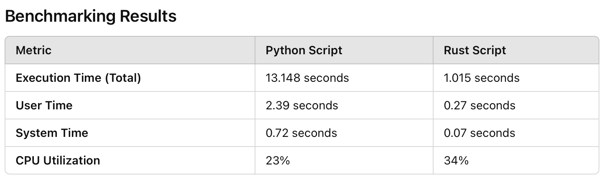

# IDS706_Rewrite_a_Python_Script_in_Rust

This is assignment is for IDS706_Rewrite_a_Python_Script_in_Rust. The original python project is for the assignment IDS706_Pandas_Descriptive_Statistics_Script (https://github.com/therealzella/IDS706_Pandas_Descriptive_Statistics_Script.git)


## Project Overview
- A `main.py` file with the core functionality.
- A `main_test.py` file with unit tests for the project.
- A `Makefile` for automating common tasks like formatting, linting, and testing.
- A `.gitignore` file to keep unnecessary files out of your repository.
- A `requirements.txt` file to manage dependencies.
- A `cereal.csv` file for the main.py to do the pandas analysis
- A `summary_statistics.csv` file to store the metrics of the cereal.csv
- A `calories_histogram.png` file to show the data visualization of the data from the cereal.csv
- A `Rust_Project` directory for rewriting codes in Rust using the same dataset.

## Python vs Rust
This chart shows the execution time for the data processing script written in Python and Rust.


## Installation
To set up this project locally, follow these steps:

1. Clone the repository:
    ```sh
    git clone https://github.com/yourusername/IDS706-python-template.git
    ```

2. Navigate to the project directory:
    ```sh
    cd IDS706-python-template
    ```

3. Create a virtual environment (optional but recommended):
    ```sh
    python3 -m venv venv
    source venv/bin/activate  # On Windows use `venv\Scripts\activate`
    ```

4. Install the required packages:
    ```sh
    make install
    ```

## Usage
You can run the main script using:
```sh
python main.py
