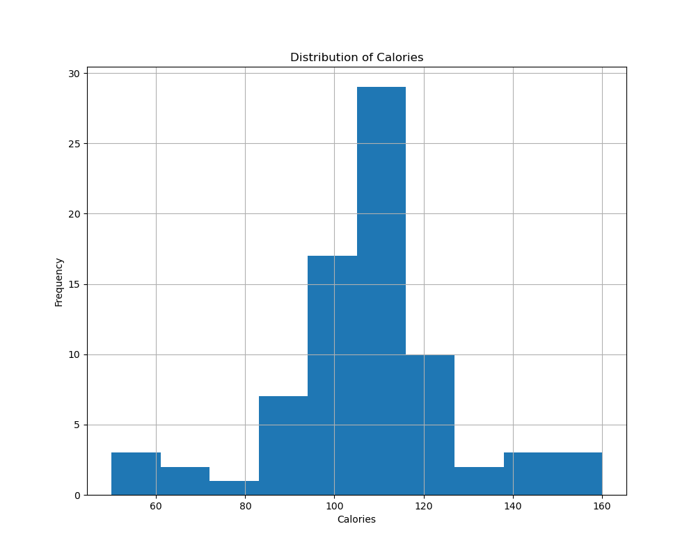

# Descriptive Statistics Summary Report

## Dataset
- **Source**: cereal.csv
- **Description**: This dataset contains information about various cereals, including calories, protein, fat, etc.

## Summary Statistics
Below are the calculated summary statistics (mean, median, and standard deviation) for key columns:

| Column     | Mean   | Median | Std Dev | Min  | Max  |
|------------|--------|--------|---------|------|------|
| Calories   | 106.88 | 110    | 19.48   | 50   | 160  |
| Protein    | 2.55   | 3.00   | 1.09    | 1.00 | 6.00 |
| Fat        | 1.01   | 1.00   | 1.00    | 0.00 | 5.00 |
| Weight     | 1.03   | 1.00   | 0.15    | 0.50 | 1.50 |
| Cups       | 0.82   | 0.75   | 0.23    | 0.25 | 1.50 |
| Rating     | 42.67  | 40.40  | 14.04   | 18.04| 93.70|

## Data Visualization
The following chart shows the distribution of calories:

## Conclusion
The dataset shows a variety of cereals with calories ranging from 50 to 160. The average cereal contains about 106.88 calories, with most cereals falling between 100 and 110 calories, as shown in the histogram.

